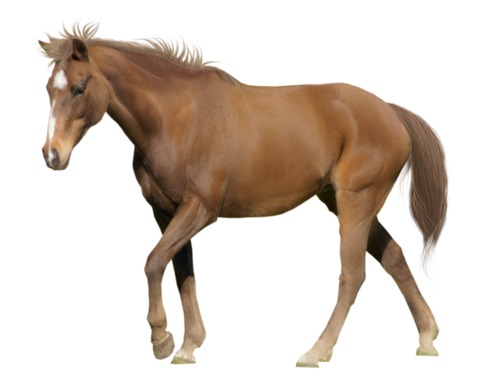
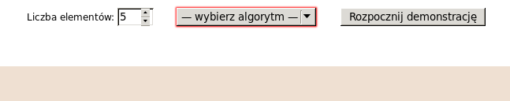

**Start:** 17 lutego 2016

**Termin nadsyłania rozwiązań:** 16 marca 2016

**Czas, który będzie Ci potrzebny na rozwiązanie całego zadania**: co
najmniej 8 godzin.

Jednym z najważniejszych zagadnień w informatyce jest sortowanie,
czyli porządkowanie przedmiotów—rosnąco lub malejąco.

Przykładowo—w dzienniku szkolnym uczniowie są zazwyczaj posortowani
(czyli uporządkowani) według nazwiska:

1. Anielewicz Barbara
2. Nemeczek Tomasz
3. Tyczyński Zygmunt
4. Zalewska Anna

W informatyce powiemy, że nazwisko Anielewicz „jest mniejsze” od
Nemeczek (gdyż litera A jest w alfabecie przed literą N).

Różne zbiory obiektów (np. ludzi, czy przedmioty) można sortować
względem róznych kryteriów (np. rozmiaru/wzrostu, nazwy).  Na przykład
mając trzy zwierzęta:

psa: , konia: 
i jeża: 

możemy posortować je względem ich wielkości:

  

albo po nazwie (alfabetycznie):

  

Istnieje wiele różnych sposobów (algorytmów) sortowania
obiektów. Twoim zadaniem będzie napisać program, który będzie
porządkować obiekty przy użyciu sortowania bąbelkowego—jednego
z łatwiejszych do zrozumienia algorytmów sortowania.

## Zanim przystąpisz do rozwiązywania

Jeżeli jeszcze tego nie zrobiłaś, na stronie
[DressCode](https://events.withgoogle.com/dresscode/) kliknij przycisk
„[Zarejestruj się](https://events.withgoogle.com/dresscode/registrations/new/)”
i wypełnij krótki formularz rejestracyjny.  Następnie [powiedz nam coś
o sobie](https://docs.google.com/a/google.com/forms/d/1jXBF3TUIn83r6SgXRT3dLofvoAJCcSf5tZev6TZfBn0/viewform)
w krótkiej anonimowej ankiecie.  Ankieta posłuży nam do jak
najlepszego dostosowania formy DressCode do Twoich preferencji.

## Co będzie Ci potrzebne

Program porządkujący „bąbelkowo” będziesz pisać przy użyciu języka
JavaScript.  Jest to język używany przez każdą przeglądarkę.  Do
rozwiązania zadania przyda Ci się znajomość jego podstaw.  Aby je
sobie przyswoić, polecamy Ci skorzystanie z jednego z poniższych
kursów:

* jeśli znasz język angielski (na poziomie VI klasy szkoły podstawowej
  powinno wystarczyć), polecamy Ci kurs
  [CodeCademy](https://www.codecademy.com/learn/javascript)—moduły od
  1 (Introduction to JavaScript) do 5 (Control Flow);

* jeśli wolisz kurs w języku polskim, polecamy Ci kurs [Khan
  Academy](https://pl.khanacademy.org/computing/computer-programming/programming)— -
  sekcje „Podstawy Rysowania”, „Zmienne”, „Bonus: Zmiana rozmiaru za
  pomocą zmiennych”, „Funkcje”, „Logika i instrukcja if” oraz
  „Zapętlanie”.  Kurs jest dostępny po polsku—jeśli wyświetla Ci się
  po angielsku, poszukaj opcji zmiany języka!

**Uwaga! Którykolwiek kurs wybierzesz, powinnaś sobie zarezerwować na
niego co najmniej 5 godzin.** Tematy tłumaczone w tych kursach są
bardzo ważne i mogą na początku nie być oczywiste—dlatego uzbrój się
w cierpliwość i daj sobie troszkę czasu.  Obiecujemy, nie będziesz
żałować. :-)

Nie będziemy sprawdzać, czy wykonałaś jakiekolwiek zadania
z kursu. Sugerujemy Ci te kursy, ponieważ będzie potrzebna Ci zawarta
w nich wiedza.

## Zadanie

Pobierz na swój komputer plik [`sortowanie.html`](https://github.com/mina86/dresscode-sorting/raw/master/sortowanie.html).
Jeżeli otworzysz ten plik w przeglądarce (np. Chrome, Firefox, Safari,
Internet Explorer), zobaczysz prosty formularz, jednak pole „— wybierz
algorytm —” nie posiada żadnych opcji do wyboru przez co próba
rozpoczęcia demonstracji kończy się niepowodzeniem.

Twoim zadaniem jest stworzenie pliku `algorytmy.js`, w którym
zaimplementujesz algorytm sortowanie bąbelkowego.

Pobierz na swój komputer plik
[`algorytmy.js`](https://github.com/mina86/dresscode-sorting/raw/master/algorytmy.js)—możesz
wykorzystać jego zawartość w swoim kodzie programu. Do edytowania
pliku wystarczy prosty edytor tekstu—taki jak Notatnik (Windows),
TextEdit (MacOS), czy gedit (Linux). Możesz użyć również bardziej
zaawansowanych edytorów—np. [Atom](https://atom.io/) czy [Sublime
Text](http://www.sublimetext.com/), które podkreślą składnię
JavaScript.  Po każdym zapisaniu zmiany w pliku `algoryrytmy.js`
odśwież otwarty w przeglądarce plik `sortowanie.html`, tak by zobaczyć
zmiany.

Dalej w instrukcji wyjaśnimy szczegółowo, na czym polegają różne
algorytmy sortowania. Tymczasem poniższy film przedstawia, jak powinna
wyglądać strona z kilkoma algorytmami sortowania:

<iframe width="480" height="480" frameborder="0" allowfullscreen
        src="https://www.youtube.com/embed/hrrjGsfpEwg"></iframe>

Zajrzyj do pliku `algorytmy.js`—zawiera on trzy przykładowe algorytmy.
Nie porządkują one elementów, a jedynie pokazują w jaki sposób na nich
operować.  Po rozwiązaniu zadania Twój plik `algorytmy.js` powinien
zawierać następujące wywołanie funkcji `zarejestrujAlgorytm`:

    zarejestrujAlgorytm(
        'Sortowanie bąbelkowe',
        function(rozmiar, porownaj, zamien) {
            // … Twoja implementacja sortowania bąbelkowego …
        }
    );

### Dostępne funkcje pomocnicze

W swoim kodzie możesz korzystać ze:

* zmiennej `rozmiar`,
* funkcji `porownaj(i, j)` oraz
* funkcji `zamien(i, j)`.

Zmienna `rozmiar` określa ile obiektów należy posortować.  Odpowiada
ona polu „Liczba elementów” w formularzu.

**Uwaga**! Elementy są numerowane od zero.  Oznacza to, że pierwszy
obiekt leży na pozycji o numerze `0`, a ostatni na pozycji `rozmiar -
1`.  Próby operowania na elementach spoza tego zakresu będą skutkować
błędnym zakończeniem algorytmu.

Funkcji `porownaj(i, j)` porównuje element na pozycji `i` z elementem
na pozycji `j`.  Jeżeli ten na pozycji `i` jest mniejszy, wynikiem
porównania jest `-1`; jeżeli obiekty są sobie równe, wynikiem jest
`0`; jeżeli element na pozycji `i` jest większy, wynikiem jest `1`.
W szczególności oznacza to, że:

* `porownaj(i, i) == 0` oraz
* `porownaj(i, j) == -porownaj(j, i)`.

No i na koniec, funkcja `zamien(i, j)` zamienia elementy na pozycji
`i` oraz `j` miejscami.  Funkcja działa poprawnie również, gdy `i`
oraz `j` są sobie równe.

Dla przykładu, wyobraźmy sobie, że mamy do czynienia z tablicą `[3, 1,
1]`.  Wówczas:

* `rozmiar == 3`,
* `porownaj(0, 1) == 1` (gdyż `3 > 1`),
* `porownaj(1, 2) == 0` (gdyż `1 == 1`),
* `porownaj(2, 0) == -1` (gdyż `1 < 3`) i jednocześnie
* wywołanie `zamien(0, 2)` zamieni tablicę do postaci `[1, 1, 3]`.

## Sortowanie przez wybór i wstawianie

Zanim przystąpisz do implementacji sortowania bąbelkowego, sugerujemy
najpierw zaimplementować sortowanie przez wybór oraz sortowanie przez
wstawianie.  Na filmie załączonym powyżej, są to dwa pierwsze
zaprezentowane algorytmy.

### Sortowanie przez wybór

<iframe width="560" height="315" frameborder="0" allowfullscreen
        src="https://www.youtube.com/embed/Ns4TPTC8whw"></iframe>

Gdy sortujemy przez wybór, wiele razy wyszukujemy (wybieramy)
najmniejszy element na liście, a następnie przesuwamy go na początek
listy.  Potem wyszukujemy drugi najmniejszy element, trzeci
najmniejszy, itd.

Algorytm można opisać następująco:

1. Niech `i = 0`.
2. Znajdź najmniejszy element spośród elementów `i`…`rozmiar-1`
   i umieść go na pozycji `i`.  W tym celu:
      i. Niech `j = i` oraz `min = i`.
     ii. Zwiększ `j` o jeden.  Jeżeli `j ≥ rozmiar`, skocz do kroku 3.
    iii. Jeżeli element na pozycji `j` jest mniejszy od tego na pozycji
         `min`, niech `min = j`.
     iv. Skocz do kroku ii.
3. Zamień element na pozycji `i` z elementem na pozycji `min`.
4. Zwiększ `i` o jeden.  Jeżeli `i < rozmiar`, skocz do kroku 2.

### Sortowanie przez wstawianie

<iframe width="560" height="315" frameborder="0" allowfullscreen
          src="https://www.youtube.com/embed/ROalU379l3U"></iframe>

Gdy sortujemy przez wstawianie, robimy coś podobnego do porządkowania
w ręce kart do gry (gdy dobieramy po jednej karcie z talii).  Kolejne
elementy z talii (czyli z końca naszej listy) wstawiamy na odpowiednie
miejsce w ręce (czyli w naszej liście).

Algorytm można opisać następująco:

1. Niech `i = 1`.
2. Jeżeli `i ≥ rozmiar`, zakończ algorytm.  Tablica jest posortowana.
3. Wstaw element na pozycji `i` na poprawną pozycję spośród elementów
   `0`…`i`.  W tym celu:
      i. Niech `j = i`.
     ii. Zmniejsz `j` o jeden.  Jeżeli `j < 0`, skocz do kroku 4.
    iii. Jeżeli element na pozycji `j` nie jest większy od elementu na
         pozycji `j+1`, skocz do kroku 4.
     iv. Zamień elementy na pozycji `j` oraz `j+1` miejscami.
      v. Skocz do kroku ii.
4. Zwiększ `i` o jeden.
5. Skocz do kroku 2.

## Sortowanie bąbelkowe

<iframe width="560" height="315" frameborder="0" allowfullscreen
          src="https://www.youtube.com/embed/MtcrEhrt_K0"></iframe>

Sortowanie bąbelkowe jest trochę bardziej skomplikowanym algorytmem.
Nazwa wywodzi się od porównania do bąbelków powietrza poruszających
się w górę w akwarium z wodą.

Gdy wykonujemy sortowanie bąbelkowe, porównujemy ze sobą kolejne pary
sąsiadujących ze sobą elementów.  Jeżeli są one w złej kolejności
(czyli najpierw większy, potem mniejszy), zamieniamy je miejscami.
Gdy wykonamy taką zamianę odpowiednio dużo razy, okaże się, że
uporządkowaliśmy całą listę.

Algorytm wygląda następująco:

1. Niech `n = rozmiar`.
2. Wykonaj pojedyncze przejście „bąbelkowania”, w tym celu:
      i. Niech `i = 0`.
     ii. Zwiększ `i` o jeden.  Jeżeli `i ≥ rozmiar`, skocz do kroku 3.
    iii. Jeżeli element na pozycji `i` jest mniejszy od elementu na
         pozycji `i - 1`, zamień elementy miejscami.
     iv. Skocz do kroku ii.
3. Zmniejsz `n` o jeden.  Jeżeli `n > 0`, skocz do kroku 2.

### Optymalizacje

Ale uwaga! Powyżej opisany algorytm można zoptymalizować
przyśpieszając jego działanie.

1. Po każdym kolejnym przejściu wewnętrznej pętli
   (t.j. „bąbelkowania”), kolejne największe elementy umieszczane są
   na poprawnej pozycji.  Fakt ten można wykorzystać modyfikując
   przejścia „bąbelkowania” tak, aby zamiast za każdym razem operować
   na elementach `0`…`rozmiar-1`, operowała na elementach z zakresu
   `0`…`n-1`.

2. Algorytm należy dodatkowo zmodyfikować w ten sposób, że powinien on
   zakończyć działanie jeżeli wewnętrzna pętla nie dokonała żadnych
   zamian.  Dla przykładu, jeżeli elementy byłyby od razu
   uporządkowane, implementacja powyższego algorytmu pracowicie
   porównywałaby ze sobą elementy nie wykonując żadnych zamian miejsc.

<u>Dopiero po zaimplementowaniu sortowania bąbelkowego z tymi dwoma
ulepszeniami, zadanie zostanie uznane za rozwiązane.</u>

## Wysyłanie rozwiązań

Po napisaniu kodu sortowania przez wybór, przez wstawianie i bąbelkowo
wyślij nam rozwiązanie przy użyciu [tego
formularza](https://docs.google.com/forms/d/1MkRyLep4CJaef4HZbD93BCmNN8mKKigHdiTCCdRevak/viewform).
Jeśli nie uda Ci się napisać wszystkich—wyślij nam te, które zdążyłaś
skończyć.

## Dla (jeszcze bardziej) ambitnych

Jeżeli zainteresował Cię temat sortowania, zachęcamy do implementacji
innych algorytmów takich jak sortowanie szybkie, czy sortowanie przez
kopcowanie.

Niestety z powodu limitacji kodu odpowiedzialnego za animacje, nie
wszystkie algorytmy mogą zostać zaimplementowane.  Np. sortowanie
przez scalanie wymaga dodatkowej tymczasowej tablicy, czego skrypt nie
udostępnia, a sortowanie kubełkowe wymaga znajomości wartości
elementów.

Więcej o różnych algorytmach sortowania możesz dowiedzieć się
[tutaj](https://pl.khanacademy.org/computing/computer-science/algorithms).
